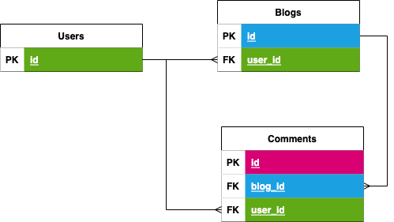
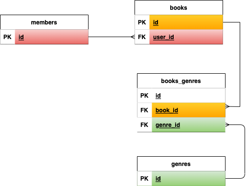

#  RESTful API Planning

---

## Getting Started

* Fork and clone this repo
* Completely read through this repo, the links from the **Reading Preparation** section, and the **How DB Models Relate to Routes in REST**
* create a restful routing chart in this `.md` file using the template provided in the **Deliverable: Planning a `REST API`** by following the directions there

## What is REST?

`REST` is an acronym for *_representational state transfer_*, and it describes a software architecture pattern that was created to solve software engineering issues presented by the world wide web. `REST` describes how an API should behave in order to maintain scalability, uniformity and backwards compatibility. Essentially, `REST` is a set of rules that if you follow, your web application's backed will be free of extremely complex and otherwise difficult to avoid bugs! You just need to learn the rules of a `RESTful API`, and how to apply them.

## Reading Preparation

The simple English Wikipedia [used to have](https://simple.wikipedia.org/w/index.php?title=Representational_state_transfer&oldid=7415343) some really great non-technical examples of `RESTful` systems. Lets read them now:

> Representational state transfer (REST) is a programming architectural implementation intended to increase the efficiency of communication in computing systems. It embodies the idea that the best way to share large amounts of data between multiple parties is to make that data available on-demand by sharing references to that data rather than a complete copy of the data itself. Systems which implement REST are called 'RESTful' systems. 

> An example of a non-RESTful real-world system would be the traditional home movie collection. In order to have access to any given movie, the library owner must obtain a physical copy of it. This results in substantial waste as more copies are in existence than are in use at any given moment. Also, the time required to add new titles to the library is generally non-trivial. Streaming video is the RESTful counterpart to the home library. Instead of having a complete copy of every movie stored in the home, the movie is referred to by its title only and the content of the movie is streamed on demand. 

> The World Wide Web is the largest example of a RESTful system today. Physical libraries are its non-RESTful equivalent. Instead of sending a physical electronic copy of every digital resource to each person or library, we assign each resource a URL identifier "http://example.com", then access the actual content via the Internet rather than retrieving a local copy from an optical disk or a hard drive. 

Read through the following links, and keep the following in mind: `REST` is a based on resources and actions that can be taken on them. Practically what this means for us a **_resource_** is a database `model` or `table`, an **_action_** is a database [CRUD](https://en.wikipedia.org/wiki/Create,_read,_update_and_delete) action, and **_URIs_** are routes on the backend.

* [Data modeling](https://medium.com/clarusway/types-of-relationships-in-data-modelling-2d5138aa62b4) -- this covers types of data relationships that are relevant to `REST API`s and `SQL` databases.
* [REST API Quick Tips](https://restapitutorial.com/lessons/restquicktips.html) -- broad stroke overview of `REST` ideas.
* [Using HTTP Methods](https://restapitutorial.com/lessons/httpmethods.html) for RESTful Services -- how CRUD relates to HTTP methods.
* [Resource Naming](https://restapitutorial.com/lessons/restfulresourcenaming.html) -- examples of good naming conventions in `REST API` urls and common pitfalls to avoid.

## How DB Models Relate to Routes in REST

### Looking at the Database Models

Here is the [ERD](https://gasei.gitbook.io/sei/04-databases/erd) for a simple blog-style social media application:

* One `user` can have many `blogs`. `Users`:`Blogs` have a **1:M** relationship
* One `blog` can have many `comments`. `Blogs`:`Comments` have a **1:M** relationship

This social media app will allow users to blog, comment on blogs, and search for other users to view the blogs and comments they have made. Users will be able to perform full CRUD actions (`CREATE READ UPDATE DESTROY`) on resources that they own. We won't worry about resource ownership, and will assume that that is handled for us.

### Designing the API

Remember, [URLs](https://en.wikipedia.org/wiki/Uniform_Resource_Identifier) represent nouns in a `RESTful API` and [HTTP methods](https://developer.mozilla.org/en-US/docs/Web/HTTP/Methods) represent the actions (verbs) taken on those nouns.

First lets make a RESTful routing chart that describes the full CRUD for our user model. This chart will include the `HTTP METHOD`, `URL`, `CRUD action` and `response` of each route. As a note, some auth setups make is so the user model and information would be hidden from the plain view of the user (in the URLs and such, for example), but assume that ours does not for this example.

| HTTP METHOD (_Verb_) | URL (_Nouns_)     | CRUD    | Response                             | Notes                                                                                                                    |
| -------------------- | ----------------- | ------- | ------------------------------------ | ------------------------------------------------------------------------------------------------------------------------ |
| GET                  | `/users`          | READ    | Array of users `{ [ user, user ] }`  | allows a user to find other users                                                                                        |
| GET                  | `/users/:user_id` | READ    | Single user `{ user }`               | details view of a single user (aka `/users/1234`) akin to a 'user profile'                                               |
| POST                 | `/users`          | CREATE  | No Data, or new user `{ user }`      | can send back a status `204` (no content), a redirect to where to find data (GET `/users/:user_id`) or just the new user data |
| PUT/PATCH            | `/users/:user_id` | UPDATE  | No data, or updated user `{ user }`  | can send back a status `204` (no content), a redirect to where to find data (GET `/users/:user_id`) or just the new user data |
| DELETE               | `/users/:user_id` | DESTROY | No data                              | can send back a status `204` (no content), a redirect to where to find data (GET `/users`)                               |

The above could be described as a template for a `REST API's` endpoints that allow for full CRUD on a database model. Take note of a few things:

* the URLs are used to only communicate information about what is having an action taken on it.
* The same url can have different HTTP verbs associated with it, each describing a different action on the same resource.
    * as a sub note, notice that this allows us to avoid url/route _anti-patterns_ such as redundancies like `POST /users/new` or `PATCH /users/:user_id/update` which communicates nothing extra by lengthening the url with useless information that is not related to the resource that is having an action taken on it.
* when `POST`ing, `PUT`ing, `PATCH`ing, or `DELETE`ing there are different options on how to handle the response, the best choice being dependant on how your API needs to work

### Planning Blog Functionality

Our API is off to a great start, lets talk about some of the other features we need to implement:

* CRUD on blogs, which have a relationship to users
* CRUD on comments, which has a relationship with users and comments

Lets start with CRUDing blogs. URLs will need to describe the relationship to users, but only when necessary. Take a moment to consider:
* when is the user who owns a blog important information to transmit in the URL? 
* What CRUD actions would require the user id? Which HTTP methods map to those CRUD Actions? 

    
Reveal the Answer

    
When a new blog in created, we will need to know which user is creating it so that data can be stored in the database as well. When `READ`ing, `UPDATING` or `DELETING`, the user who created the resource isn't strictly necessary. A URL pattern of `POST /users/:user_id/blog` would make sense, while the rest of the HTTP methods can happen have an action on simply `/blogs`. Users and blogs have a `1:M` or parent/child relationship, and so the creation of a user blog resource  on the url of `users/:user_id/blog` describes all of the resources involved in the transaction, and also implies their relationship.

This is assuming the database is managing relational information with something like [SQL foreign keys](https://www.w3schools.com/SQL/sql_ref_foreign_key.asp) or [MongoDB Refs](https://www.mongodb.com/docs/manual/reference/database-references/). Say, for example, the database was storing relational data using MongoDB's [document](https://www.mongodb.com/basics/embedded-mongodb) embedding. How would this change your API structure and routes? 
    
Here is our `RESTful` routing chart for CRUD on our blog model:
    
| HTTP METHOD (_Verb_) | URL (_Nouns_)           | CRUD    | Response                                | Notes                                                                                                                         |
| -------------------- | ----------------------- | ------- | --------------------------------------- | ----------------------------------------------------------------------------------------------------------------------------- |
| GET                  | `/blogs`                | READ    | Array of all blogs `{ [ blog, blog ] }` | allows a user to see all blogs made by all users                                                                              |
| GET                  | `/blogs/:blog_id`       | READ    | Single blog details `{ blog }`          | details view of a single blog (aka `/blog/1234`) akin to a 'blog detail view'                                                 |
| POST                 | `/users/:user_id/blogs` | CREATE  | No Data, or new blog `{ blog }`         | can send back a status `204` (no content), a redirect to where to find data (GET `/blog/:blog_id`) or just the new blog data  |
| PUT/PATCH            | `/blogs/:blog_id`       | UPDATE  | No data, or updated blog `{ blog }`     | can send back a status `204` (no content), a redirect to where to find data (GET `/blogs/:blog_id`) or just the new user data |
| DELETE               | `/blogs/:blog_id`       | DESTROY | No data                                 | can send back a status `204` (no content), a redirect to where to find data (GET `/blogs`)                                    |
    
Notice that the one URL that deviates from the users chart is `POST`ing a new blog, since a relationship is involved. A blog cannot be made without a user being involved, which is why this is the only way to create a new blog.
    
What about retrieving all of a single users blogs? It is present state, `GET /users/:user_id`, could serve this purpose; sending all of the user data to display including their blogs, but depending on how your API needed to serve data, it would make sense in some circumstances to have a `POST /users/:user_id/blogs` to retrieve all of the blog made by the user with an id of `:user_id`. The purpose of `REST` is to uniformly describe actions taken on resources, not strictly dictate the structure of an `API`.

Sometimes a _URL_ with more than one variadic route parameter is referred to as a _Compound Url_.

### Planning Comment Functionality

Comments are going to have the most complex relationships we have planned so far: a comment needs to know:

1. the user that created the comment
1. the blog that is being commented on  

This is going to create more complex compound URLs to describe the actions being taken on resources. Take some time to consider the routes that would be needed to let a user CRUD comments: 

* Which of the HTTP methods will create transactions in the database that require information on the relationships? 
* Which methods will not need any database model except comments?

    
Reveal the Answer

    
When a new comment is created, we will need to know not only which user is creating it, but also the blog that the comment is on. The url should reflect all of the models that are involved in this action: users, blogs, and comments. 
    
When `READ`ing, `UPDATING` or `DELETING`, the user who created the comment, and the blog that it is on, isn't strictly necessary. It _MIGHT_ be needed, but isn't strictly needed. 
    
Here is our `RESTful` routing chart for CRUD on our comment model:
    
| HTTP METHOD (_Verb_) | URL (_Nouns_)                            | CRUD    | Response                                  | Notes                                                                                                                           |
| -------------------- | ---------------------------------------- | ------- | ----------------------------------------- | ------------------------------------------------------------------------------------------------------------------------------- |
| POST                 | `/users/:user_id/blog/:blog_id/comments` | CREATE  | No Data                                   | can send back a status `204` (no content), a redirect to where to find data (GET `/blogs/:_id`) or just the new comment data    |
| PUT/PATCH            | `/comments/:comments_id`                 | UPDATE  | No data, or updated comment `{ comment }` | can send back a status `204` (no content), a redirect to where to find data (GET `/blog/:blog_id`) or just the new comment data |
| DELETE               | `/comments/:comments_id`                 | DESTROY | No data                                   | can send back a status `204` (no content), a redirect to where to find data (GET `/blogs`)                                      |
    
This chart is actually a little smaller. Why is that? `GET /comments` and `GET /comments/:comment_id` are notably omitted. Why is that?
    
Does it make sense from as user experience perspective to show all comments made on all blogs? Is that meaningful data? What about a comment details page? Does a comment have enough context outside of its relationship to a blog to merit this route? What about sending back a comment after `POST`ing a new one to the database? Is that the best way to handle sending back comment data?

Because a `comment` has no meaningful context without the `post`, these data routes are not needed. There isn't really a user experience that would merit seeing every comment ever made.

It is always important to consider the context of the data, the data relationships, and the end user experience when creating an API.

## Deliverable: Planning a `REST API`

Now it is time for you to plan a `RESTful API` of your own. Take a look at this ERD for a library management system, you will be writing a restful routing chart for it:

* One `member` can have many `books`. `Members`:`Books` have a **1:M** relationship. This relationship describes books being checked out of the library. It is possible for a `book` to not have a `member`, if it is not checked out.
* One `book` can have many `genres`, and a `genre` can have many `books`. `Books`:`Genres` have a **N:M** relationship. 
* The table `books_genres` is simply a join table, used to to maintain a **N:M** relationship. It shouldn't be a part of any **URL**.

Your Task is to write a `RESTful` routing chart for the library system's API. Your API will need to serve full CRUD on `members`, `books`, and `genres`. Do not worry about authentication, another team is handling that. 

You can use this markdown chart:

| HTTP METHOD (_Verb_) | URL (_Nouns_) | CRUD | Response | Notes |
| -------------------- | ------------- | ---- | -------- | ----- |
|                      |               |      |          |       |
|                      |               |      |          |       |

#### Things to keep in mind

* A `book` can exist in the database without a member creating it, unlike our blog example. How will this affect the API's endpoints (_URLs_)?
* You will need to create routes that allow `members` to checkout `books` and return `books` to the library. What HTTP methods should you use for these? What _URLs_ would best describe that models that are having actions taken on them _and_ the relationships between the data.
	* **HINT:** if your _URLs_ have the word `checkout` in them, you are falling victim to one of the dreaded **_anti-patterns_**!
* `books` and `genres` are **N:M** and we have the following user stories. Think of the  `HTTP methods` first and then think about the _URLs_. How can you best describe the data relationships in your _URLs_:
	* as a user, I would like to see all the genres a particular book is in.
	* as a user, I would like to see all the books a particular genre has is in it.
* You will need routes to handle adding a book to a genre and vice-versa

---

## Licensing
1. All content is licensed under a CC-BY-NC-SA 4.0 license.
2. All software code is licensed under GNU GPLv3. For commercial use or alternative licensing, please contact legal@ga.co.
